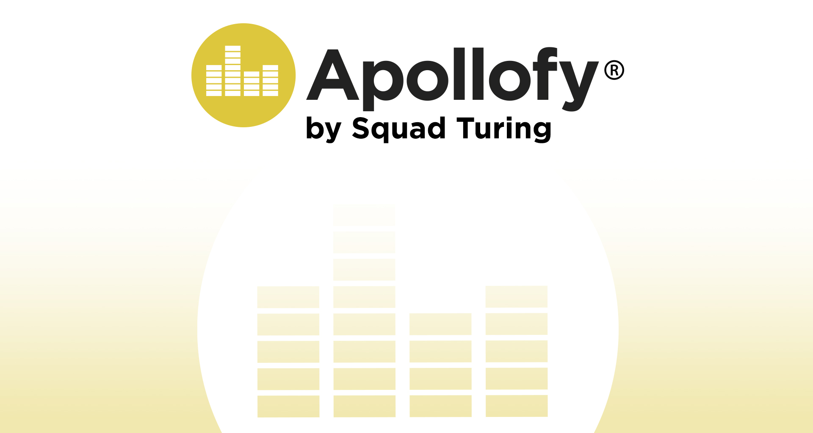

`#react` `#assembler-institute-of-technology` `#master-in-software-engineering` `#ReactEcommerce` `#ReactTS` `#ReactHooks` `#CustomHooks` `#StyledComponents` `#TypeScript` `#CSS` `#Figma` `#ReactOptimization`

# Apollofy Project

The project consists of creating a web music platform based on Spotify and SoundCloud.

## Initializing project

pnpm install
pnpx json-server src/assets/data/seed.json
pnpm run dev

## Stacks

- [Vite](https://vitejs.dev)
- [Swiper](https://swiperjs.com/react)
- [Slider](https://ui.shadcn.com/docs/components/slider)
- [Figma](https://www.figma.com/file/7lhmv02VMCkOUmZ0JO4stN/Apollofy?type=design&node-id=0%3A1&mode=design&t=pYiBo7LP1Pc47B9R-1)

## Daily log

Day 1: February 29
ClickUp creation and organization
Figma Design
Repository on GitHub
Connect VSCode with GitHub
Branch creation
Virtual server creation

Day 2: March 1
Figma Design
Routes
Enter user login with JSON
Register user
Delete user

Day 3: March 3
Group Gmail account creation
cloudinary creation
Track upload and json update
Layout profile page layout

Day 4: March 4
Finish profile management layout
Layout welcome page and paint news
Favorites list layout
Detail page layout
Upload of 3 extra songs to the server
Lateral Menu

Day 5: March 5
Song player operation
Dynamic Song Detail Page
Search bar

Day 6: March 6
End search bar
Layout with ❤️ in song details
Convert the bar into a link to the song detail
Wishlist favorite songs list
Player volume

Day 7: March 7
Features and track status bar
Interactive search
Details like song page, bottom player and track list
Create card with featured tracks and favorite list as components
Design and layout v. laptop

Day 8: March 8
Layout v. laptop

Day 9: March 10
Layout v. laptop
JSON update

Day 10: March 11
NavPlayer v. Layout laptop
Sliders for project presentation
